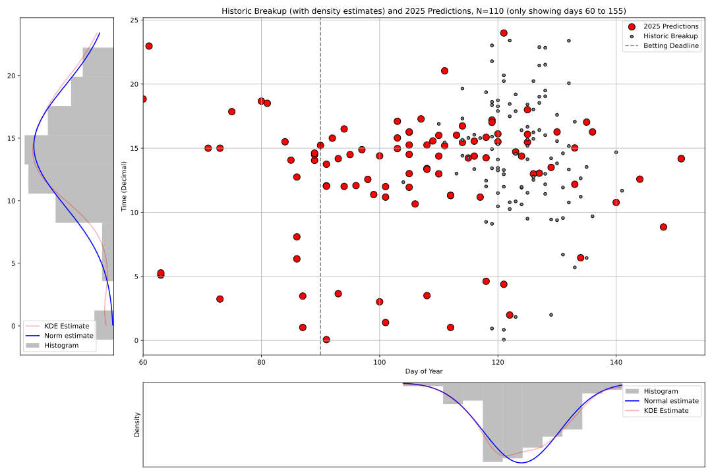
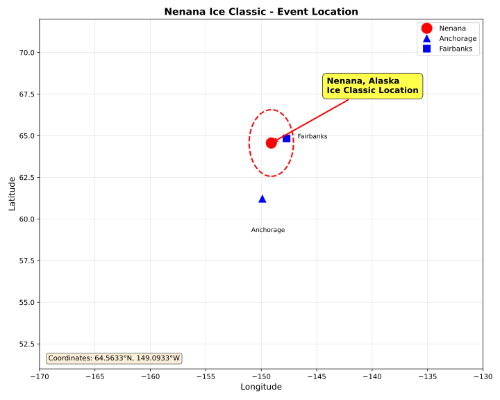

# Ice Classic - MUDE PA 1.5

The figure here shows predictions between the beginning of March and beginning of June. See `predictions_all.svg` to see predictions that fall outside of that range of days.

## Event Location

The Nenana Ice Classic takes place in Nenana, Alaska, located on the Tanana River. The map below shows the geographic location of the event.

